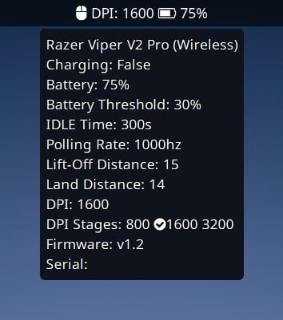

# RAZERCTL

Console utility for changing the settings of razer devices.
Part of the code was taken from [OpenRazer](https://github.com/openrazer/openrazer/) project.

## Features

- Does not require build linux kernel modules.
  Mingw-w64 successfully compiles the project and theoretically should work under Windows
- Set and get mouse DPI
- Set and get mouse Lift-Off Distance. OpenRazer can't do it (now only for *Razer Viper V2 Pro* and *Razer DeathAdder V3 Pro*, [TODO](TODO.md))
- Set IDLE time for power-save
- Set low battery threshold. When the value is reached, power-saving mode is activated. OpenRazer does not work correctly with values
- Set and get mouse polling rate
- Print serial number and firmware version
- Integration with [Waybar](https://github.com/Alexays/Waybar)



Since I do not need to control the backlight, this functionality is unlikely to be added.

`razerctl --help`

```text
Usage: razerctl [OPTION]...
  --help               Print this help and exit
  --json               Output format JSON
  --devices            Print only device list
  --device             Device ID. If not set then all devices
  --lod                Set Lift-Off Distance. Avaible values: low, medium, high.
  --async-lod          Set Async Lift-Off Distance. First parameter - Lift-Off Distance, Second parameter - Landing Distance. 2 <= LOD <= 26 and 1 <= LD <= 25.
  --polling-rate       Set polling rate. Available values: 125, 250, 500, 1000, 2000, 4000, 8000
  --dpi                Set DPI. Examples: 800 - DPI x=800 y=800, 800x1200 - DPI x=800 y=1200
  --idle-time          Set idle time for powersave in seconds. Must be between 60-900
  --battery-threshold  Set low battery charge % threshold for pawersave on. Example: 0 - 100
  --active-stage       Set active DPI stage. Example: 2
  --dpi-stages         Set DPI stages. Comma separator. Space symbols are not allowed. Example: 800,1600,3200 or 800x800,1600x1600,3200x3200
```

## Support devices

- Razer Viper V2 Pro (**Tested**)
- Razer DeathAdder V3 Pro (**Hardware is the same as in Viper V2 Pro**)
- Razer HyperPolling Wireless Dongle (**Not tested**)
- Razer Viper 8KHz (**Not tested**)
- Razer Mamba Elite (Wired) (**Tested**)
- Razer DeathAdder Chroma (**Tested**)

Since the code is universal, new devices are easy to add to [devices.h](src/device.h)

## Requirements

- [Meson](https://mesonbuild.com/) build system
- [Linux HIDRAW](https://docs.kernel.org/hid/hidraw.html) or [libusb](https://github.com/libusb/libusb) library

## How to use

In order for `razerctl` to be able to access razer devices without root privileges,
need to give the necessary device privileges.
Copy udev rules to `/etc/udev/rules.d` and restart udev.

```bash
sudo cp -v udev/99-razer-mouse.rules /etc/udev/rules.d
sudo udevadm control --reload-rules
sudo udevadm trigger
```

Reconnect your razer device. Run `razerctl`.

`TAG+="uaccess"` only gives permission to physically present users.
If method not working, then edit `/etc/udev/rules.d/99-razer-mouse.rules` file and replace:

```text
SUBSYSTEM=="usb|input|hid", TAG+="uaccess"
KERNEL=="hidraw*", TAG+="uaccess"

# SUBSYSTEM=="usb|input|hid", GROUP="plugdev", MODE="0660"
# KERNEL=="hidraw*", GROUP="plugdev", MODE="0660"
```

with:

```text
# SUBSYSTEM=="usb|input|hid", TAG+="uaccess"
# KERNEL=="hidraw*", TAG+="uaccess"

SUBSYSTEM=="usb|input|hid", GROUP="plugdev", MODE="0660"
KERNEL=="hidraw*", GROUP="plugdev", MODE="0660"
```

Check if the `plugdev` group exists in the system, if it does not exist, add it.
Add a current user to a group `plugdev`.

```bash
grep -q "^plugdev" /etc/group || sudo groupadd plugdev
sudo usermod -a -G plugdev $USER
```

Reload udev rules:

```bash
sudo udevadm control --reload-rules
sudo udevadm trigger
```

Reconnect your razer device, then log out and log in back (or reboot computer). Run `razerctl`.

## Waybar integration

Install FontAwesome. Edit `razerctl-waybar.py`

Replace `device_id` and `razerctl` to yours.

```python
device_id = 1  # Device ID
razerctl = 'razerctl'  # Path to razerctl binary
```

Add custom block to your `$HOME/.config/waybar/config`.
Replace `{PATH}` with real path to `razerctl-waybar.py` script.

```json
"custom/razer_mouse": {
    "format": "{}",
    "tooltip": true,
    "interval": 300,
    "return-type": "json",
    "exec": "python {PATH}/razerctl-waybar.py"
}
```

Add `"custom/razer_mouse"` to `"modules-left"` or `"modules-center"` or `"modules-right"`.

Example:

```json
{
  "modules-left": [
    "hyprland/workspaces",
    "hyprland/submap"
  ],
  "modules-center": [
    "temperature",
    "cpu",
    "memory",
    "custom/razer_mouse"
  ],
  "modules-right": [
    "tray",
    "pulseaudio",
    "network",
    "clock",
    "custom/power"
  ],
  "custom/razer_mouse": {
    "format": "{}",
    "tooltip": true,
    "interval": 300,
    "return-type": "json",
    "exec": "python {PATH}/razerctl-waybar.py"
  }
}
```

## Compilation

Clone repository and enter to source directory.

```bash
git clone https://github.com/h0tc0d3/razerctl.git
cd razerctl
```

### Build with HIDRAW Support

HIDRAW does not block the device, so it is recommended.
Blocking devices with libusb can cause problems while playing games if razerctl is running.

```bash
meson setup --buildtype debug build
ninja compile -C build
```

### Build with libusb support

```bash
meson setup --buildtype debug -Dlibusb=true -Dhidraw=false build
ninja compile -C build
```

### Build with HIDRAW and libusb support

```bash
meson setup --buildtype debug -Dlibusb=true -Dhidraw=true build
ninja compile -C build
```

## Reverse Engineering USB devices

[Reverse Engineering USB devices](REVERSE_ENGINEERING.md)

## License

The project is licensed under the [GNU GPLv3](LICENSE) and is not officially endorsed by [Razer, Inc.](https://www.razerzone.com)
