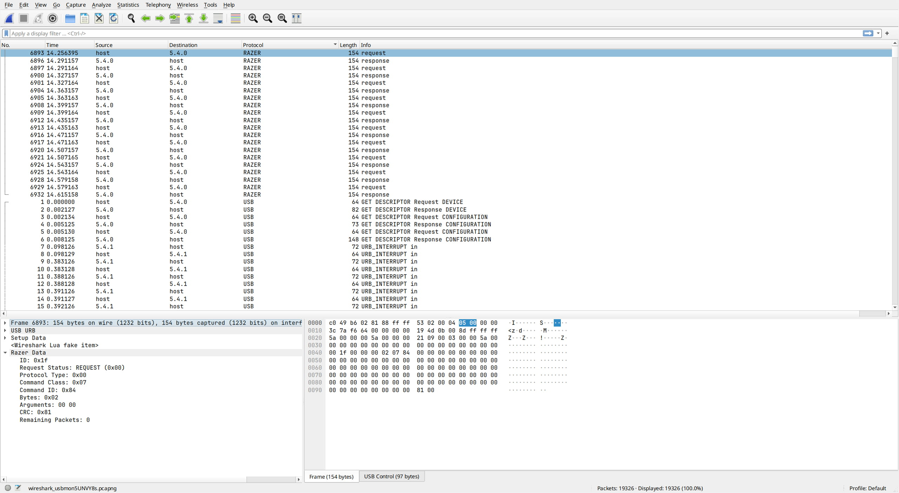

# Reverse Engineering USB devices

To reduce the amount of noise - extra packets from the device, we need a second mouse.

Load usbmon module:

```bash
sudo modprobe usbmon
```

Find device:

```bash
lsusb
```

```text
Bus 005 Device 004: ID 1532:00a6 Razer USA, Ltd Razer Viper V2 Pro
```

Start QEMU with Windows OS installed.
Add device to VM parameters: `-usb -device usb-host,hostbus=5,hostaddr=4`

Example:

```text
qemu-system-x86_64 \
  -m 4096 \
  -cpu host \
  -smp cores=2,cpus=4 \
  -enable-kvm \
  -machine q35,accel=kvm \
  -device amd-iommu \
  -nic user \
  -drive file={PATH}/windows.qcow2,format=qcow2 \
  -device VGA,vgamem_mb=512 \
  -usb -device usb-host,hostbus=5,hostaddr=4
```

Copy wireshark razer protocol dissector to `.wireshark/plugins/` directory:

```bash
mkdir -p .wireshark/plugins/
cp wireshark/razer.lua .wireshark/plugins/
```

Add permissions to `/dev/usbmon{bus}`.

```bash
sudo chown $USER:$USER /dev/usbmon5
```

Start wireshark and run capture `usbmon{bus}`. Analize packets:


